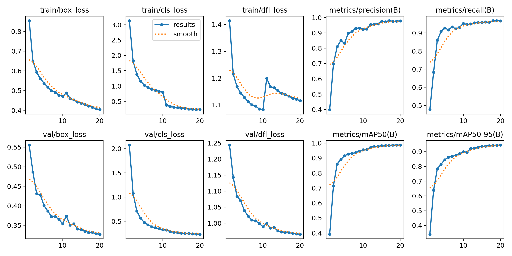

# 🚦 Enlighten-YOLO: Low-Light Traffic Sign Detection

[](https://www.python.org/downloads/)
[](https://pytorch.org/)
[](https://github.com/ultralytics/ultralytics)
[](https://opensource.org/licenses/MIT)

A robust traffic sign detection system that leverages **EnlightenGAN** for low-light image enhancement combined with **YOLOv8** for real-time object detection on the **GTSRB dataset**.

## 🎯 Training Results

**Model Performance** (YOLOv8n, 20 epochs, 11.79 hours):
- ✅ **mAP@0.5**: 98.65%
- ✅ **Precision**: 97.85%
- ✅ **Recall**: 96.60%
- ✅ **mAP@0.5:0.95**: 94.46%

📊 **[View Detailed Training Results](results/TRAINING_RESULTS.md)**



## 🌟 Features

- 🌙 **Low-Light Enhancement**: EnlightenGAN-based illumination improvement
- 🎯 **High Accuracy**: YOLOv8 nano model for efficient detection
- 🚀 **Real-Time Performance**: Optimized for GPU acceleration
- 📊 **GTSRB Dataset**: 43 classes of German traffic signs
- 🔧 **Easy Setup**: Step-by-step scripts for beginners
- 📈 **Visualization Tools**: Compare original, low-light, and enhanced images

## 🏗️ Project Structure

```
├── step1_check_environment.py      # Environment verification
├── step2_auto_download_dataset.py  # Automatic dataset download
├── step3_convert_dataset_kaggle.py # Dataset format conversion
├── step4_create_lowlight.py        # Generate low-light images
├── step5_enhance_images.py         # Image enhancement
├── step6_train_model.py            # Model training
├── step7_evaluate_model.py         # Model evaluation
├── step8_test_single_image.py      # Single image testing
├── enlightened_gtsrb.py            # Main detector class
├── enlightengan_inference.py       # EnlightenGAN inference engine
├── data_preparation.py             # Data preprocessing utilities
├── reorganize_dataset.py           # Dataset reorganization for YOLO
├── test_enhancement.py             # Enhancement visualization
├── visualize_comparison.py         # Comparison tool
└── requirements.txt                # Dependencies
```

## 📋 Requirements

### Hardware
- **GPU**: NVIDIA GPU with 4GB+ VRAM (RTX 3060/4060 recommended)
- **RAM**: 8GB+ system memory
- **Storage**: 10GB+ free space

### Software
- Python 3.9+
- CUDA 11.8+ (for GPU acceleration)
- Conda or pip

## 🚀 Quick Start

### 1️⃣ Clone the Repository

```bash
git clone https://github.com/Iapetussss/Enlighten-YOLO-Low-Light-Traffic-Sign-Detection-with-GAN-Powered-Illumination-Enhancement.git
cd Enlighten-YOLO-Low-Light-Traffic-Sign-Detection-with-GAN-Powered-Illumination-Enhancement
```

### 2️⃣ Create Environment

```bash
# Using Conda (recommended)
conda create -n yoloen python=3.9
conda activate yoloen

# Install PyTorch with CUDA
pip install torch torchvision torchaudio --index-url https://download.pytorch.org/whl/cu121
```

### 3️⃣ Install Dependencies

```bash
pip install -r requirements.txt
```

### 4️⃣ Verify Environment

```bash
python step1_check_environment.py
```

### 5️⃣ Download Dataset

```bash
python step2_auto_download_dataset.py
```

### 6️⃣ Prepare Dataset

```bash
# Convert dataset to YOLO format
python step3_convert_dataset_kaggle.py

# Generate low-light images
python step4_create_lowlight.py

# Enhance images
python step5_enhance_images.py

# Reorganize for YOLO
python reorganize_dataset.py
```

### 7️⃣ Train Model

```bash
python step6_train_model.py
```

**Training Parameters:**
- Model: `n` (nano, fastest)
- Epochs: `20` (quick test) or `50` (better results)
- Batch: `2` (for 8GB VRAM) or `1` (for 4GB VRAM)
- Device: `0` (GPU)

### 8️⃣ Evaluate & Test

```bash
# Evaluate on validation set
python step7_evaluate_model.py

# Test single image
python step8_test_single_image.py
```

## 📊 Dataset

This project uses the **GTSRB (German Traffic Sign Recognition Benchmark)** dataset:

- **43 classes** of traffic signs
- **~51,000 images** total
- **Train/Val/Test split**: 60%/15%/25%

### Dataset Classes

Speed limits, warning signs, prohibitory signs, mandatory signs, and more. See `traffic_signs_dataset.yaml` for the complete list.

## 🎨 Enhancement Comparison

The project includes visualization tools to compare:
- Original images
- Synthetic low-light images
- Enhanced images (using improved traditional methods or EnlightenGAN)

```bash
python test_enhancement.py
```

## 🏋️ Training Tips

### For 8GB VRAM (RTX 4060):
- Batch size: 2
- Workers: 2
- AMP: Disabled (for stability)

### For 4GB VRAM:
- Batch size: 1
- Workers: 1
- Consider using CPU for data loading

### For 12GB+ VRAM:
- Batch size: 4-8
- Workers: 4-8
- AMP: Enabled

## 📈 Expected Results

| Model | Batch | Epochs | mAP@0.5 | Training Time |
|-------|-------|--------|---------|---------------|
| YOLOv8n | 2 | 20 | ~85% | 2-3 hours |
| YOLOv8n | 2 | 50 | ~90% | 5-7 hours |
| YOLOv8s | 4 | 50 | ~92% | 8-10 hours |

*Results may vary based on hardware and dataset quality*

## 🛠️ Troubleshooting

### CUDA Out of Memory
- Reduce batch size to 1
- Close other GPU applications
- Use `workers=1`

### Slow Training
- Ensure GPU is being used (`device='0'`)
- Check CUDA installation
- Reduce image size to 416

### Dataset Issues
- Re-run `step3_convert_dataset_kaggle.py`
- Check `yolo_dataset` directory structure
- Verify `traffic_signs_dataset.yaml` paths

## 📚 Documentation

- [YOLOv8 Documentation](https://docs.ultralytics.com/)
- [GTSRB Dataset](https://benchmark.ini.rub.de/)
- [EnlightenGAN Paper](https://arxiv.org/abs/1906.06972)

## 🤝 Contributing

Contributions are welcome! Please feel free to submit a Pull Request.

## 📄 License

This project is licensed under the MIT License - see the LICENSE file for details.

## 🙏 Acknowledgments

- **YOLOv8**: Ultralytics team for the excellent object detection framework
- **EnlightenGAN**: For the low-light enhancement technique
- **GTSRB**: For providing the traffic sign dataset
- **Tiger Detection Project**: Inspiration from [JFM269's project](https://github.com/JFM269/Tiger-Detection-using-EnlightenGAN-and-Yolo)

## 📧 Contact

For questions or issues, please open an issue on GitHub.

## ⭐ Star History

If you find this project helpful, please consider giving it a star! ⭐

---

**Made with ❤️ for safer autonomous driving**
