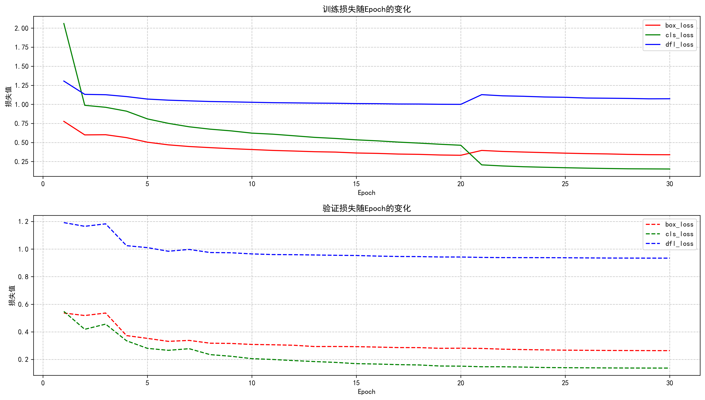
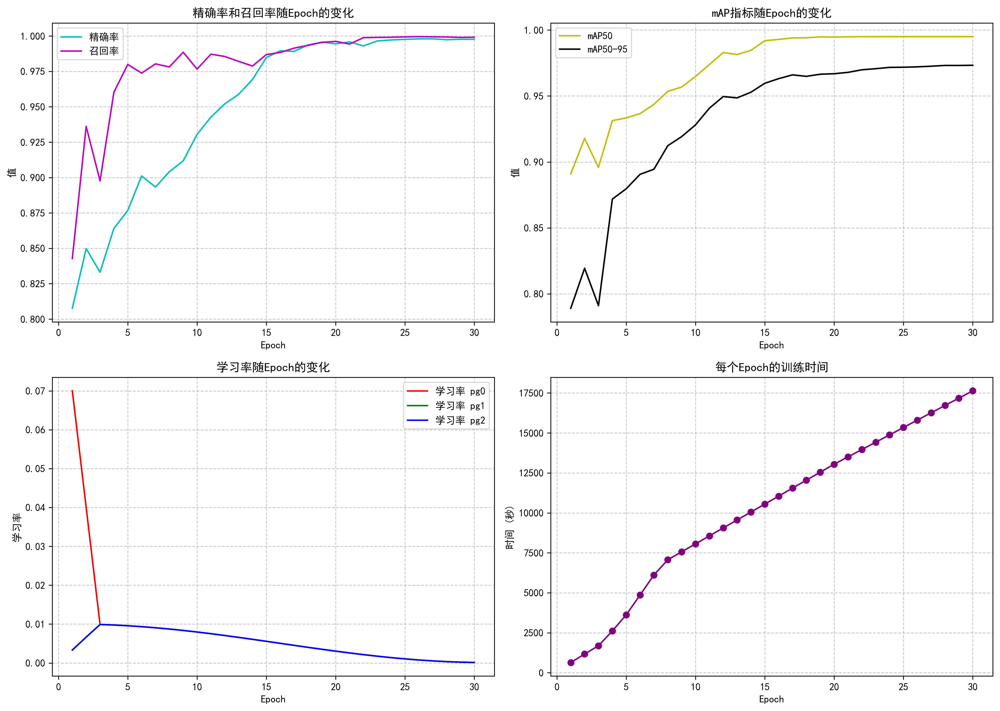
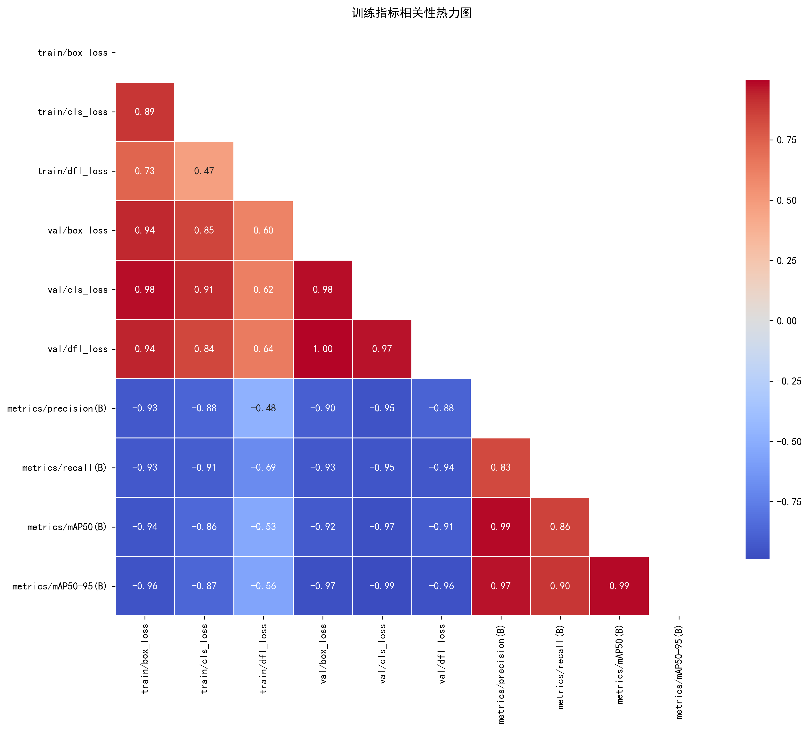
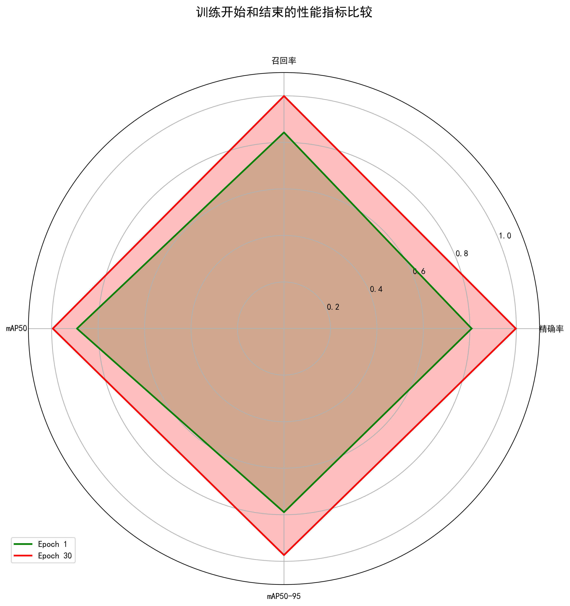

# YOLOv8 交通标志检测模型训练分析报告

  
  
<strong>🚦 高性能交通标志检测模型训练过程详解</strong>

## 📊 训练概览

训练时间: **2025年10月31日 - 2025年11月1日**

| 训练参数 | 数值 |
|---------|------|
| 模型类型 | YOLOv8s |
| 训练轮数 | 30 |
| 批次大小 | 16 |
| 图像大小 | 640×640 |
| 优化器 | SGD |
| 学习率策略 | 余弦退火 |
| 数据集 | new_GTSRB |

## 🎯 最终性能指标

  

    <h4>🔹 精确率</h4>
    
99.77%

  

  

    <h4>🔹 召回率</h4>
    
99.91%

  

  

    <h4>🔹 mAP50</h4>
    
99.50%

  

  

    <h4>🔹 mAP50-95</h4>
    
97.33%

  

## 📈 训练指标可视化

### 1. 损失值变化趋势

  

**损失值分析:**
- **训练损失**：从第一个epoch的总和约4.14，逐渐下降到最后一个epoch的约1.56，下降了约62%。
- **box_loss**：从0.78降至0.34，说明模型定位能力显著提升。
- **cls_loss**：从2.06大幅下降到0.15，表明分类准确率大幅提高。
- **dfl_loss**：从1.31降至1.07，边界框回归损失稳定下降。
- **验证损失**：保持与训练损失相似的下降趋势，但数值更低，表明模型泛化能力良好。

### 2. 性能指标变化

  

**性能指标分析:**
- **精确率与召回率**：精确率从80.76%快速上升到99.77%，召回率从84.28%提升到99.91%。
- **mAP50**：从89.10%稳步提升到99.50%，最终达到几乎完美的检测效果。
- **mAP50-95**：从78.91%提升到97.33%，表明在不同IoU阈值下都有出色表现。
- **学习率**：采用余弦退火策略，从较高的初始值逐渐降低，有助于模型收敛和避免过拟合。
- **训练时间**：每个epoch的训练时间相对稳定，表明训练过程高效。

### 3. 指标相关性分析

  

**相关性分析洞察:**
- **正相关**：验证集的box_loss、cls_loss和dfl_loss之间存在强正相关，表明这些损失组件协同变化。
- **负相关**：损失值与性能指标（精确率、召回率、mAP）呈现明显的负相关，损失下降伴随着性能提升。
- **训练与验证一致性**：训练损失和验证损失之间存在较强相关性，说明模型训练稳定，没有明显过拟合。

### 4. 训练前后性能对比

  

**性能提升对比:**
- **精确率**：从80.76%提升到99.77%，增长了19.01个百分点。
- **召回率**：从84.28%提升到99.91%，增长了15.63个百分点。
- **mAP50**：从89.10%提升到99.50%，增长了10.40个百分点。
- **mAP50-95**：从78.91%提升到97.33%，增长了18.42个百分点。
- **全方位提升**：雷达图清晰展示了模型在所有关键性能指标上的显著进步。

## 🔍 训练过程深度分析

### 阶段划分

1. **快速提升阶段 (Epoch 1-10)**
   - 所有性能指标快速上升，损失值急剧下降
   - mAP50从89.10%提升到约97%
   - 模型快速学习基本特征和模式

2. **稳定提升阶段 (Epoch 11-20)**
   - 性能指标持续上升但速度放缓
   - 损失值继续稳步下降
   - 模型开始学习细粒度特征

3. **精细调优阶段 (Epoch 21-30)**
   - 性能指标小幅提升，趋近于极限
   - 学习率进一步降低
   - 模型参数精细化调整，泛化能力增强

### 关键发现

- **模型收敛性**：训练在30个epoch内成功收敛，最终mAP50达到99.50%，表明模型对数据集有极佳的适应能力。
- **过拟合控制**：验证损失与训练损失保持同步下降，没有出现明显的过拟合现象，余弦退火学习率策略效果良好。
- **分类与定位平衡**：box_loss和cls_loss的同步下降表明模型在定位和分类任务上都取得了均衡的改进。
- **计算效率**：训练过程高效稳定，每个epoch的训练时间相对一致，表明训练配置合理。

## 📝 结论与建议

### 总体结论

训练的YOLOv8s模型在交通标志检测任务上表现出色，最终达到了接近完美的检测性能。这表明：

- **模型选择恰当**：YOLOv8s在精度和速度之间取得了良好的平衡。
- **训练策略有效**：SGD优化器结合余弦退火学习率表现优秀。
- **数据集质量高**：new_GTSRB数据集提供了足够的训练信息，支持模型达到高准确率。

### 优化建议

1. **模型轻量化**：
   - 考虑使用YOLOv8n进行部署，在保持高精度的同时提高推理速度。

2. **数据增强**：
   - 可以尝试更多的数据增强技术，如随机缩放、旋转、亮度变化等，进一步提高模型的鲁棒性。

3. **超参数调优**：
   - 尝试不同的学习率初始值和衰减策略，可能会进一步提升性能。
   - 探索其他优化器如AdamW的效果。

4. **模型集成**：
   - 考虑集成多个不同训练参数的模型，可能会进一步提高检测性能。

5. **部署优化**：
   - 利用模型量化和剪枝技术，优化模型在边缘设备上的部署效果。

## 🚀 后续工作方向

- **实际场景测试**：在真实道路场景中测试模型性能
- **多尺度目标优化**：针对不同大小的交通标志进行专项优化
- **实时性能评估**：测量模型在实际应用环境中的推理速度
- **异常检测能力**：评估模型对未见过的交通标志类型的鲁棒性

---

  
📊 报告生成时间: 2025年11月1日

  
🎯 模型保存路径: <code>runs/detect/new_gtsrb_yolov8_v2/weights/best.pt</code>

